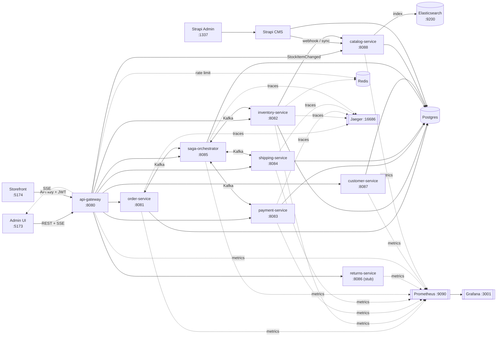

# commerce-ops

Event-driven order and inventory management system built as independently
deployable Spring Boot microservices, coordinated by an orchestrated saga
over Kafka, with an outbox for reliable event publishing, idempotent
consumers, a Redis-backed inventory cache, an API gateway with auth/rate
limiting, and a React admin console with live updates.

## Overview

A customer-facing `order-service` accepts orders; `saga-orchestrator` then
drives the order through inventory reservation, payment capture, and
shipment creation across `inventory-service`, `payment-service`, and
`shipping-service` -- compensating (releasing inventory / refunding payment)
automatically if any step fails. `api-gateway` is the single ingress the
`admin-ui` console talks to: it proxies requests to each backend service,
enforces an API key and Redis-backed rate limits, and streams live order/saga
updates to the UI over Server-Sent Events. Every service is independently
buildable, runnable, and observable.



See [`docs/architecture.md`](docs/architecture.md) for the full breakdown of
services, Kafka topics, the outbox/idempotency patterns, the gateway, and the
observability stack, and [`docs/saga.md`](docs/saga.md) for the saga's state
machine, compensation logic, timeouts, and chaos triggers.

## Quick start

```bash
# 1–3. infra + build + every backend (including config-server + api-gateway)
scripts/start-services.sh --infra --build

# Auth BFF / OIDC (Keycloak via gateway only — frontends never call :8180):
# scripts/start-services.sh --infra --oidc --build

# 4. run the admin UI
cd admin-ui && npm install && npm run dev
# OIDC: VITE_SECURITY_MODE=oidc npm run dev

# 5. (optional) run the customer storefront
cd storefront && npm install && npm run dev
```

Or step by step: `docker compose up -d`, then `mvn -q -DskipTests package`,
then `scripts/start-services.sh`. Stop with `scripts/stop-services.sh`
(`--infra` also stops Compose).

On first Strapi boot, open `http://localhost:1337/admin` and create the admin
user. Demo categories/products for inventory SKUs (`SKU-TEE-001`, etc.) are
seeded and published automatically. Merchandising edits stay in Strapi;
stock and price stay in Inventory.
Full walkthrough, including demo flows for the happy path, a chaos-induced
payment failure, and gateway rate limiting, is in
[`docs/runbook.md`](docs/runbook.md).

## Ports

| Component | Port | Status |
|-----------|------|--------|
| `api-gateway` | 8080 | Phase 1 |
| `order-service` | 8081 | Phase 1 |
| `inventory-service` | 8082 | Phase 1 |
| `payment-service` | 8083 | Phase 1 |
| `shipping-service` | 8084 | Phase 1 |
| `saga-orchestrator` | 8085 | Phase 1 |
| `returns-service` | 8086 | Phase 2 (stub) |
| `customer-service` | 8087 | Phase 1 |
| `catalog-service` | 8088 | Phase 1 |
| `admin-ui` | 5173 | Phase 1 |
| `storefront` | 5174 | Customer shop |
| Strapi Admin | 1337 | Merchandising CMS |
| Elasticsearch | 9200 | Catalog search |
| Postgres | 5433 | infra |
| Redis | 6379 | infra |
| Kafka | 9092 | infra |
| Jaeger UI | 16686 | infra |
| Prometheus | 9090 | infra |
| Grafana | 3001 | infra (`admin`/`admin`) |

## Phase 1 vs Phase 2

**Phase 1 (complete)** -- the full order fulfillment saga and its
supporting platform:

- `order-service`, `inventory-service`, `payment-service`,
  `shipping-service`, and `saga-orchestrator`, each with their own Postgres
  schema, Flyway migrations, and Kafka producers/consumers.
- `customer-service` -- email/password registration, JWT login, and a
  multi-address book (exactly one default) used at storefront checkout.
- `catalog-service` -- storefront catalog read model: inventory projection via
  Kafka `StockItemChanged`, Strapi merchandising sync (title/slug/copy/gallery),
  and Elasticsearch search index (`catalog_products`). Only published +
  non-deleted SKUs appear on the storefront.
- `api-gateway` -- single ingress for the admin UI and storefront:
  proxies `/api/**`, enforces admin or scoped storefront `X-API-Key`s, applies
  a Redis-backed sliding-window rate limit to write endpoints, validates
  customer JWTs on protected storefront routes, and fans out Kafka domain
  events to the admin UI over SSE (`GET /api/stream/orders`).
- `admin-ui` -- a React + TypeScript console (orders list/detail, inventory,
  sagas, demo flows) that consumes `api-gateway` and updates live via SSE.
  Merchandising is edited in Strapi (`Open Strapi CMS` in the sidebar).
- `storefront` -- customer shop (search/facets → PDP → cart → login → address
  selection → checkout → order history) on port 5174 using the scoped
  storefront API key plus a customer Bearer JWT.
- Strapi (`strapi/`) -- self-hosted CMS for product merchandising; Product.sku
  must match inventory SKU. Media served from Strapi uploads.
- Shared `libs/`: `common-events` (envelope/topic/payload contracts),
  `common-kafka` (transactional outbox + DLQ error handling),
  `common-idempotency` (exactly-once-effect consumers), and
  `common-observability` (tracing/metrics/logging defaults).
- Redis-backed inventory read cache, chaos-testing hooks for payment and
  shipment failures, and a full docker-compose observability stack
  (Jaeger, Prometheus, Grafana, OTel collector).

**Phase 2 (in progress)**:

- `returns-service` is scaffolded (this repo) as a Phase 2 stub -- it
  compiles, runs on port 8086, and exposes placeholder endpoints, ahead of
  implementing the RMA → restock → refund saga described in
  [`docs/architecture.md`](docs/architecture.md#services) and
  [`services/returns-service/README.md`](services/returns-service/README.md).
