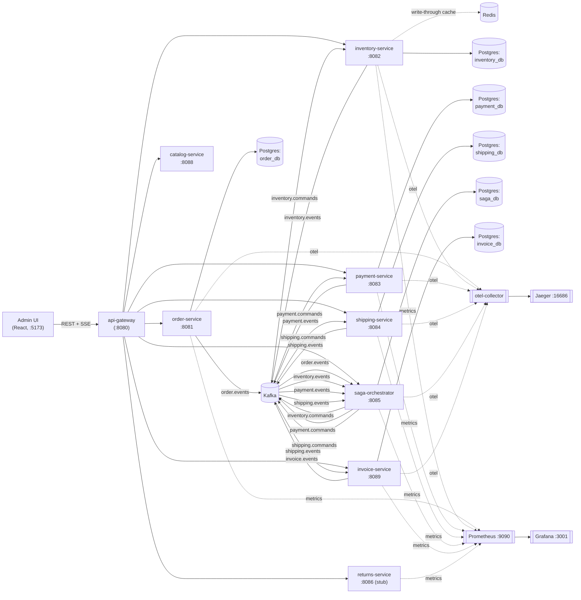

# Architecture

`commerce-ops` is an event-driven order and inventory management system. An
**orchestrated saga** (`saga-orchestrator`) drives a happy-path order through
four independently deployable services -- Order, Inventory, Payment, and
Shipping -- coordinating them over Kafka and compensating (undoing) already
completed steps whenever something downstream fails.



## Services

| Service            | Port | Owns                                   | Persistence                     |
|---------------------|------|-----------------------------------------|----------------------------------|
| `order-service`      | 8081 | Order lifecycle, client-facing API      | `order_db` (Postgres)            |
| `inventory-service`  | 8082 | Stock levels, reservations              | `inventory_db` (Postgres) + Redis cache |
| `payment-service`    | 8083 | Payment capture / refund, chaos knob    | `payment_db` (Postgres)          |
| `shipping-service`   | 8084 | Simulated shipment booking + admin Advance tracking lifecycle (Shiprocket adapter dormant) | `shipping_db` (Postgres) |
| `saga-orchestrator`  | 8085 | Cross-service saga state machine        | `saga_db` (Postgres)             |
| `returns-service`    | 8086 | **Phase 2 stub** -- RMA/restock/refund (not yet implemented) | `returns_db` reserved, unused by the stub |
| `customer-service`   | 8087 | Accounts, JWT auth, multi-address book  | `customer_db` (Postgres)         |
| `catalog-service`    | 8088 | Storefront catalog projection from inventory | `catalog_db` (Postgres)     |
| `invoice-service`    | 8089 | GST-style tax invoice + PDF after shipment   | `invoice_db` (Postgres)      |
| `config-server`      | 8888 | Spring Cloud Config Server (native `config-repo/`) | -- (filesystem / classpath) |
| `api-gateway`        | 8080 | Auth (API key + customer JWT), rate limit, proxy, SSE | Redis (rate limit)    |
| `admin-ui`           | 5173 | React console (Vite dev server) -- orders list/detail, inventory, sagas, live updates via SSE | -- (talks to `api-gateway` only) |
| `storefront`         | 5174 | Customer shop -- catalog, cart, auth, addresses, checkout, order history | -- (talks to `api-gateway` only) |

Each service is a Spring Boot 3.3 / Java 17 application built from the
shared parent POM at the repo root. `admin-ui` is the one exception -- a
Vite + React + TypeScript SPA that only talks to `api-gateway`. Four internal
libraries (`libs/`) provide cross-cutting concerns for the Java services
(the `returns-service` stub only pulls in `common-events` and
`common-observability`, since it has no persistence or messaging yet):

- **`common-events`** -- the `EventEnvelope` wrapper (event id, type,
  aggregate id, correlation/causation/saga ids, timestamp, JSON payload),
  the `Payloads` record catalogue, `EventTypes`, and `Topics` constants
  shared by every producer/consumer so services agree on wire format without
  a runtime schema registry.
- **`common-kafka`** -- the transactional **outbox** pattern
  (`OutboxEvent` + `OutboxEventRepository` + `OutboxService`): a service
  writes its domain event to an `outbox_events` table in the same DB
  transaction as its business change, and a `@Scheduled` `OutboxRelay` polls
  and publishes pending rows to Kafka every `commerce.outbox.poll-ms` (500ms
  by default). This guarantees at-least-once delivery without dual-write
  inconsistency between the DB and the broker. `KafkaCommonConfig` also wires
  a `DefaultErrorHandler` with exponential backoff that dead-letters
  permanently failing records to `<topic>.dlq`.
- **`common-idempotency`** -- `IdempotencyService.markIfNew(consumerGroup,
  eventId)` backed by a `processed_events` table with a
  `(consumer_group, event_id)` primary key. Every Kafka listener calls this
  before acting on a message, so redelivered or duplicate events are safely
  no-ops. `order-service` additionally has a `client_idempotency` table keyed
  by the client-supplied `Idempotency-Key` header for `POST /api/orders`.
- **`common-observability`** -- an auto-configuration (picked up via
  `META-INF/spring/…AutoConfiguration.imports`, no explicit import needed)
  that registers request logging plus wires Micrometer + OTLP tracing and
  Prometheus metrics defaults for every service that depends on it.
- **`common-web`** -- shared HTTP success envelope (`ApiResponse`) and error
  body (`ApiError`), plus `ApiResponseBodyAdvice` / `ApiExceptionHandler`
  auto-config. Controllers return DTOs; the advice wraps them. Use
  `@ApiMessage("…")` or `ApiResponse.ok(data, message)` for custom success
  copy, and `BusinessException` / service-specific handlers for custom errors.
  Mark proxies, PDFs, SSE, and external webhooks with `@RawResponse`.

## HTTP API responses

All JSON endpoints use one contract (see `libs/common-web`):

**Success**
```json
{
  "success": true,
  "message": "Order created successfully",
  "data": { },
  "meta": { "timestamp": "2026-07-23T22:40:00Z", "path": "/api/orders" }
}
```

**Error**
```json
{
  "success": false,
  "timestamp": "2026-07-23T22:40:00Z",
  "status": 400,
  "error": "Bad Request",
  "message": "Please check your details and try again.",
  "details": ["postalCode: must not be blank"],
  "path": "/api/customers/me/addresses",
  "retryAfterSeconds": null
}
```

`message` is always customer/ops-facing. Storefront and admin API clients
unwrap `data` automatically. Exclusions (not enveloped): PDF downloads, SSE
streams, actuator/health, empty `204`, Razorpay/Strapi webhooks, and gateway
proxy passthrough of already-enveloped downstream JSON.

## api-gateway

`api-gateway` is the single ingress the admin UI talks to; it never touches
Postgres and has no domain model of its own -- it is a thin BFF over the
other services:

- **Proxying** -- `OrderProxyController`, `InventoryProxyController`,
  `PaymentProxyController`, `ShippingProxyController`, and
  `SagaProxyController` each forward `/api/**` requests to the matching
  downstream service's base URL (`commerce.gateway.services.*`) via a shared
  `ProxyGateway`/`RestClient`. `OrderTimelineController` aggregates a single
  order's order/saga/payment/shipment state into one response for the UI.
- **Auth** -- Dual mode via `commerce.security.mode`:
  - **`legacy` (default local):** `ApiKeyAuthFilter` requires `X-API-Key` (admin or
    storefront) on `/api/*`; storefront scope + customer JWT filters apply.
    Admin login is `POST /api/auth/login` returning the configured API key.
  - **`oidc`:** api-gateway is an **OIDC BFF**. Confidential clients
    `admin-ui-bff` / `storefront-bff` run Authorization Code against Keycloak;
    tokens live in **Spring Session (Redis)** behind httpOnly `COMMERCE_SESSION`.
    Frontends only call `/api/auth/login|callback|logout|me` and APIs with
    `credentials: 'include'` — never Keycloak or `keycloak-js`. Resource server
    validates the session access token (JWKS). Realm roles `admin` / `customer`
    map to `ROLE_ADMIN` / `ROLE_CUSTOMER`. `OidcIdentityBridgeFilter` fills the
    same request attributes proxy controllers already use.
  Under `k8s`/`prod` profiles, placeholder secrets refuse to boot
  (`ProdSecretsValidator`).
- **Rate limiting** -- `RateLimitFilter` + `RateLimiterService` apply a
  Redis-backed sliding-window limit (`commerce.gateway.rate-limit.limit` /
  `window-seconds`, default 30 requests / 60s) to write methods
  (POST/PUT/PATCH/DELETE) under `/api/**`, keyed by API key or client IP.
  Responses include `X-RateLimit-Limit` / `X-RateLimit-Remaining`, and a
  throttled request gets `429 Too Many Requests` with a `Retry-After`
  header. If Redis is unavailable the limiter fails open (allows the
  request) rather than blocking traffic.
- **Circuit breakers** -- each downstream `RestClient` (order, inventory,
  payment, shipping, saga, customer, catalog, invoice) is wrapped by a
  named Resilience4j circuit breaker in `ProxyGateway`. Connect/read
  timeouts are 2s/5s. Failures that trip the breaker: connection errors,
  timeouts, and downstream 5xx. Client 4xx do **not** trip the breaker.
  When a circuit is **OPEN**, the gateway returns **503** with
  `Service temporarily unavailable; try again shortly.` Metrics appear as
  `resilience4j_circuitbreaker_*` on the gateway Prometheus scrape.
  External integrations (Razorpay, Shiprocket) and internal service→service
  HTTP clients use the same pattern with their own named breakers.
- **Service discovery (EKS)** -- there is no Eureka/Consul client. On
  Kubernetes, discovery is **Service DNS**: RestClients call stable names
  such as `http://order-service:8081`. Activate Spring profile `k8s`
  (`SPRING_PROFILES_ACTIVE=k8s`) so gateway and peer HTTP clients use those
  hosts (see `application-k8s.yml` and `config-repo/*-k8s.yml`). Local /
  default profile keeps `http://localhost:808x`. Scaling replicas is handled
  by the ClusterIP Service; callers do not change. Manifests live under
  `deploy/k8s/`.
- **Live updates** -- `LiveUpdateListener` consumes `order.events`,
  `saga.events`, `inventory.events`, `payment.events`, and `shipping.events`
  and fans each envelope out over Server-Sent Events via
  `SseBroadcastService` to any client connected to
  `GET /api/stream/orders`, so the admin UI updates without polling.

## Identity (Keycloak + Auth BFF)

Local Docker Compose runs **Keycloak** on host port **8180** with realm
`commerce-ops` imported from [`deploy/keycloak/`](../deploy/keycloak/).
When `VITE_SECURITY_MODE=oidc`, admin-ui / storefront redirect to the gateway
BFF (`GET /api/auth/login?client=admin-ui|storefront`); the browser never calls
Keycloak directly. Gateway issuer + client registrations live in
`application-oidc.yml` (`OAUTH2_ISSUER_URI`,
`KEYCLOAK_ADMIN_UI_BFF_SECRET`, `KEYCLOAK_STOREFRONT_BFF_SECRET`). Customer
profiles are auto-provisioned in `customer-service` on first `/me` using
`X-Commerce-Customer-Id` from the gateway (Keycloak `customer_id` claim or
`sub`). Secrets inventory and network boundary notes live in the runbook.

## Config Server

`config-server` (port **8888**) is a Spring Cloud Config Server using the
**native** backend. Non-secret shared and per-service settings live in the
monorepo [`config-repo/`](../config-repo/) directory (also baked into the
config-server jar at build time). Clients import config with:

```yaml
spring.config.import: "optional:configserver:${CONFIG_SERVER_URL:http://localhost:8888}"
```

`optional:` means a service still boots from its classpath `application.yml`
when Config Server is down. Secrets (DB passwords, API keys, Razorpay /
Shiprocket credentials) stay in env / K8s Secret — not in `config-repo`.
v1 does not use Spring Cloud Bus; change a property and **restart** the
client to pick it up. On EKS, ConfigMap sets
`CONFIG_SERVER_URL=http://config-server:8888`.

## Kafka topics

| Topic                    | Producer            | Consumer(s)        | Purpose                              |
|----------------------------|----------------------|----------------------|----------------------------------------|
| `order.events`             | order-service        | saga-orchestrator    | `OrderCreated`, `OrderCancelRequested` |
| `inventory.commands`       | saga-orchestrator     | inventory-service    | `ReserveInventory`, `ReleaseInventory` |
| `inventory.events`         | inventory-service     | saga-orchestrator    | `InventoryReserved`, `InventoryReserveFailed`, `InventoryReleased` |
| `payment.commands`         | saga-orchestrator     | payment-service      | `CapturePayment`, `RefundPayment`      |
| `payment.events`           | payment-service       | saga-orchestrator    | `PaymentCaptured`, `PaymentFailed`, `PaymentRefunded` |
| `shipping.commands`        | saga-orchestrator     | shipping-service     | `CreateShipment`                       |
| `shipping.events`          | shipping-service      | saga-orchestrator, invoice-service | `ShipmentCreated`, `ShipmentFailed`, `ShipmentStatusUpdated` (UI/tracking; saga ignores) |
| `invoice.events`           | invoice-service       | (outbox / future consumers) | `InvoiceIssued` |
| `saga.events`              | saga-orchestrator     | api-gateway (SSE fan-out) | `SagaStepCompleted`, `SagaCompleted`, `SagaCompensated`, `SagaFailed` |
| `*.events.dlq`             | Kafka error handler   | (manual inspection)  | Dead letters after exhausted retries   |

`api-gateway` additionally consumes `order.events`, `inventory.events`,
`payment.events`, and `shipping.events` (alongside `saga-orchestrator`) as a
second consumer group (`api-gateway`), purely to re-broadcast them over SSE
to the admin UI -- it never acts on them.

### Shipping (simulated carrier)

`shipping-service` defaults to the **simulated** carrier (`commerce.shipping.provider=simulated`):

- After payment the saga stays **`PAID`** until an admin books a shipment
  (`POST /api/shipments` with `{ "orderId" }`) — there is no auto `CreateShipment`.
- Books a fake AWB (`SIM-…`) and demo label URL; chaos via `NOSHIP-*` / chaos endpoint.
- Saga + invoice complete on **`ShipmentCreated`** (label booked); order → **`SHIPPING`**.
- Tracking via admin Advance; when shipment is **`DELIVERED`**, order → **`DELIVERED`**.
- Customer/admin may cancel while order is **`PAID`** (pre-ship only).

A Shiprocket adapter remains in the codebase (dormant) behind
`SHIPPING_PROVIDER=shiprocket`; it is not part of the supported local demo path.

See `docs/saga.md` for the full step-by-step saga flow and compensation
logic.

## Redis

`inventory-service` uses Redis (`redis:7-alpine`, port 6379) purely as a
**write-through read cache** in front of `stock_items`
(`InventoryCacheService`, keys `inventory:stock:{sku}`): every stock mutation
writes the new available quantity to Redis in addition to Postgres, and cache
reads/writes fail open (logged and ignored) so Redis being unavailable never
blocks a reservation.

`api-gateway` also uses Redis, independently, for its rate limiter: each
identifier (API key or IP) gets a `gateway:ratelimit:{identifier}` sorted set
of request timestamps, trimmed and counted atomically by a Lua script on
every write request (see the `api-gateway` section above). There is no
session storage on Redis today.

## Observability

The stack ships with:

- **Distributed tracing** -- every service exports OTLP traces to the
  `otel-collector` (`:4318` HTTP / `:4317` gRPC from inside Docker,
  remapped to host ports `4320`/`4319`), which forwards to
  **Jaeger** at [http://localhost:16686](http://localhost:16686). Trace
  sampling is 100% (`management.tracing.sampling.probability: 1.0`) so every
  saga run is fully visible end-to-end via the shared `correlationId`/`sagaId`.
- **Metrics** -- each service exposes `/actuator/prometheus`, including
  `api-gateway` and the `returns-service` stub; **Prometheus**
  (`http://localhost:9090`) scrapes all of them (see
  `observability/prometheus.yml`) on a 15s interval.
- **Dashboards** -- **Grafana** (`http://localhost:3001`, `admin`/`admin`)
  is provisioned with Prometheus as its default datasource
  (`observability/grafana/provisioning`).
- **Logs** -- `CommonsRequestLoggingFilter` (from `common-observability`)
  logs every inbound HTTP request per service; each service also logs saga
  step transitions at `INFO`.

## Phase 1 vs Phase 2

See the root `README.md` for the Phase 1 / Phase 2 breakdown; in short,
Phase 1 is the fully working order fulfillment saga (Order → Inventory →
Payment → Shipping) plus `api-gateway`, `admin-ui`, and the observability
stack, and Phase 2 begins with the `returns-service` scaffold documented
above, ahead of implementing the RMA → restock → refund saga.
