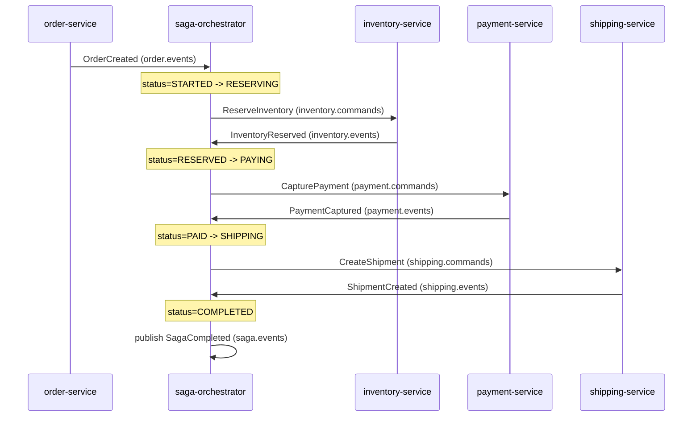

# Order Fulfillment Saga

The `saga-orchestrator` service implements an **orchestrated saga** (as
opposed to choreography): it owns the state machine, sends commands to each
participant, and reacts to the resulting events. Each `SagaInstance` row
tracks `status`, `currentStep`, `stepDeadline`, `retryCount`, and the ids it
has accumulated so far (`reservationId`, `paymentId`, `shipmentId`). Every
transition is also appended to `saga_step_log` for audit/debugging.

All command/event handlers are guarded by both the shared
`IdempotencyService` (per-consumer-group, per-`eventId`) and an explicit
status check on the saga itself (e.g. "only accept `InventoryReserved` while
`status == RESERVING`"), so redelivered or out-of-order Kafka messages are
safely ignored rather than double-applied.

## Happy path

## State machine

`SagaStatus`: `STARTED → RESERVING → RESERVED → PAYING → PAID → SHIPPING →
COMPLETED`, with `COMPENSATING → COMPENSATED` and `FAILED_NEEDS_ATTENTION`
as the two terminal failure branches (`SagaStatus.isTerminal()` covers
`COMPLETED`, `COMPENSATED`, and `FAILED_NEEDS_ATTENTION`).

| Step | Command sent | Success event → next status | Failure event → action |
|------|---------------|------------------------------|--------------------------|
| 1. Order received | -- | `OrderCreated` → `RESERVING` (sends `ReserveInventory`) | -- |
| 2. Reserve inventory | `ReserveInventory` | `InventoryReserved` → `RESERVED` → `PAYING` (sends `CapturePayment`) | `InventoryReserveFailed` → nothing to compensate yet → `COMPENSATED` (terminal `SagaFailed`) |
| 3. Capture payment | `CapturePayment` | `PaymentCaptured` → saga/order **`PAID`** (awaits admin; **no** auto `CreateShipment`, no step deadline) | `PaymentFailed` → compensate: release inventory only |
| 4. Book shipment | Admin `POST /api/shipments` | `ShipmentCreated` → saga **`COMPLETED`**; order **`SHIPPING`**; invoice issued | `ShipmentFailed` → compensate: refund payment, then release inventory |

While saga is `PAID`, customer or admin may cancel (`OrderCancelRequested`) → refund + release.

`ShipmentCreated` means the simulated carrier label/AWB was booked. Later
tracking is admin `POST /api/shipments/{id}/advance`
(`PICKED_UP` → `DELIVERED`). When shipment reaches `DELIVERED`, order becomes
**`DELIVERED`** (`ShipmentStatusUpdated`). The saga stays `COMPLETED` after label book.

## Compensations

Compensating a partially completed saga always **unwinds steps in reverse
order**, and only touches resources that were actually acquired:

- **Inventory reserved, then failure before payment** (payment failed, order
  cancelled before payment, or a `RESERVING`/`PAYING` timeout) →
  `ReleaseInventory` only. Status goes `COMPENSATING` (`currentStep =
  RELEASE_INVENTORY`) → `InventoryReleased` → `COMPENSATED`.
- **Payment captured, then failure before/at shipment** (shipment failed, or
  a `SHIPPING` timeout) → `RefundPayment` first, then `ReleaseInventory` once
  the refund is confirmed. Status goes `COMPENSATING`
  (`currentStep = REFUND_PAYMENT`) → `PaymentRefunded` →
  (`currentStep = RELEASE_INVENTORY`) → `InventoryReleased` →
  `COMPENSATED`.
- **Cancellation requested by the customer** (`OrderCancelRequested`) is
  handled the same way based on how far the saga has progressed: refund+release
  if a payment exists, release-only if only inventory was reserved, or an
  immediate `COMPENSATED` if nothing was reserved yet.

Every terminal outcome (`SagaCompleted`, `SagaCompensated`, `SagaFailed`) is
published to `saga.events` via `SagaCommandPublisher.publishTerminal(...)`.

## Timeouts and retries

A `@Scheduled` timeout scanner (`commerce.saga.timeout-scan-ms`, default
5000ms) looks for sagas whose `stepDeadline` has passed
(`commerce.saga.step-timeout-seconds`, default 30s per step) and calls
`handleTimeout`:

- Each timeout increments `retryCount`. Once `retryCount` exceeds
  `commerce.saga.max-retries` (default 3), the saga is force-terminated as
  `FAILED_NEEDS_ATTENTION` regardless of which step is stuck.
- Otherwise the behavior depends on the current status:
  - `RESERVING` timeout → nothing was reserved yet, so it goes straight to
    `FAILED_NEEDS_ATTENTION` (there is nothing safe to retry automatically).
  - `PAYING` timeout → compensate by releasing inventory (same as a
    `PaymentFailed`).
  - `PAID` (awaiting admin ship) has **no** `stepDeadline` and is not timed out.
  - Legacy `SHIPPING` timeout (auto-create path) → compensate by refunding
    then releasing inventory.
  - `COMPENSATING` timeout → escalate to `FAILED_NEEDS_ATTENTION` since a
    stuck compensation step needs human intervention rather than an automatic
    retry.

## Chaos triggers (for demos)

The participant services expose deterministic and configurable ways to
force a failure, so you can reliably exercise the compensation paths above
without waiting for a real error:

| Trigger | Where | Effect |
|---------|-------|--------|
| Order id prefixed `FAIL-` | `payment-service` (`PaymentService.simulateCaptureFailure`) | `CapturePayment` always fails with `PaymentFailed` → saga compensates by releasing inventory |
| Currency `FAIL` | `payment-service` | Same as above, keyed off `cmd.currency()` instead of order id |
| Order total amount ending in `.99` | `payment-service` | Deterministic demo trigger for a payment failure without needing a special order id (e.g. order total `$19.99`) |
| `POST /api/payments/chaos?failureRate=0.3` | `payment-service` (`ChaosSettings`) | Sets a random capture failure probability (0.0–1.0), applied to any order that doesn't already match one of the rules above |
| Order id prefixed `NOSHIP-` | `shipping-service` (`SimulatedShippingProvider`) | `CreateShipment` always fails with `ShipmentFailed` → saga compensates by refunding payment, then releasing inventory |
| `POST /api/shipments/chaos?failureRate=0.3` | `shipping-service` (`ChaosSettings`) | Sets a random shipment failure probability, same semantics as the payment chaos knob |
| `POST /api/shipments` with `{ "orderId" }` | `shipping-service` (admin) | Books simulated label for a `PAID` order; publishes `ShipmentCreated` / `ShipmentFailed` |
| `POST /api/shipments/{id}/advance` | `shipping-service` (admin; simulated path) | Advances tracking: CREATED → … → DELIVERED; order becomes `DELIVERED` on final step (saga already `COMPLETED`) |

Both chaos knobs reset to `0.0` on service restart (they are in-memory only,
seeded from `commerce.payment.failure-rate` / `commerce.shipping.failure-rate`
in `application.yml`).
